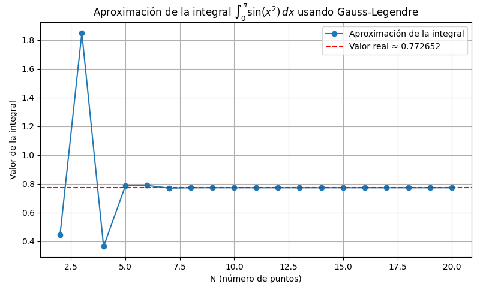

# Tutorial

En este apartado nos centraremos en la explicación de como utilizar el código de este proyecto para calcular una integral definida utilizando la técnica de **cuadratura gaussiana**.

# Introducción Rápida
En este tutorial, aprenderemos a implementar y utilizar la **cuadratura gaussiana** para calcular la siguiente integral:
\begin{align}
\int_{0}^{\pi} \sin(x^2)dx
\end{align}

# Requisitos previos
Antes de comenzar, asegurarse de tener instaladas las siguientes bibliiotecas en python:
```python
pip install numpy
pip install matplotlib
```

## Paso 1: Crear el archivo
Desde la terminal creamos el archivo usando touch, por ejemplo:
touch cuadratura.py. 
Esto nos crea un archivo vacío de python.

## Paso 2: Importar las bibliotecas
```python
import numpy as np
import matplotlib.pyplot as plt
```

## Paso 3: Definir la función para puntos y pesos de Gauss-Legendre
```python
def gaussxw(N):
    x, w = np.polynomial.legendre.leggauss(N)
    return x, w
```
Esta función retorna los puntos de muestreo (x) y pesos (w) en el intervalo $[-1, 1]$ para un N dado.
## Paso 4: Escalar al intervalo deseado
```python
def gaussxwab(a, b, x, w):
    return 0.5 * (b - a) * x + 0.5 * (b + a), 0.5 * (b - a) * w
```
Esta función transforma los puntos y pesos del intervalo estándar $[-1, 1]$ al intervalo $[a, b]$.

## Paso 5: Obtener los puntos y pesos
```python
xN8, wN8 = gaussxw(8)
xN9, wN9 = gaussxw(9)
xN10, wN10 = gaussxw(10)
```
Se utilizan valores de $N = 8, 9, 10$ para lograr una mejor aproximación de la integral, ya que la función es oscilatoria.

## Paso 6: Escalar al intervalo $[0, \pi]$
```python
puntoMuestreoxN8, pesoMuestreowN8 = gaussxwab(0, np.pi, xN8, wN8)
puntoMuestreoxN9, pesoMuestreowN9 = gaussxwab(0, np.pi, xN9, wN9)
puntoMuestreoxN10, pesoMuestreowN10 = gaussxwab(0, np.pi, xN10, wN10)
```

#Paso 7: Definir la función a integrar
```python
def integralAproximada(argumento):
    return np.sin(argumento * argumento)
```
Esta función representa el integrando $\sin(x^2)$.

## Paso 8: Calcular las aproximaciones
```python
print(f"La aproximación de la integral con N=8 es {np.sum(pesoMuestreowN8 * integralAproximada(puntoMuestreoxN8)):.6f}")
print(f"La aproximación de la integral con N=9 es {np.sum(pesoMuestreowN9 * integralAproximada(puntoMuestreoxN9)):.6f}")
print(f"La aproximación de la integral con N=10 es {np.sum(pesoMuestreowN10 * integralAproximada(puntoMuestreoxN10)):.6f}")
```
# Planteamos los códigos necesarios para la grafica de la integral vs los valores de N

## Paso 9: Valores de N e inicializar el arreglo de resultados
```python
valoresN = np.arange(2, 21)
resultadoIntegral = np.zeros(valoresN.size)
```

## Paso 10: Realizamos el ciclo for para que recorra cada uno de los valores de N
```python
for i, N in enumerate(valoresN):
    x, w = gaussxw(N) # Obtener los puntos y pesos
    xN, wN = gaussxwab(0, np.pi, x, w) # Escalar al intervalo [0, π]
    resultadoIntegral[i] = np.sum(wN * integralAproximada(xN)) # Aproximación y almacenarla en el arreglo resultadoIntegral
```

## Paso 11: Graficamos los resultados junto al valor aproximado de la integral
El valor real(Aproximado de la integral) se obtuvo mediante el programa de wolfram Alpha [Resultado Integral](https://www.wolframalpha.com/input?i2d=true&i=Integrate%5BSin%5BPower%5Bx%2C2%5D%5D%2C%7Bx%2C0%2C%CF%80%7D%5D&lang=es)

```python
plt.figure(figsize=(8, 5))
plt.plot(valoresN, resultadoIntegral, marker='o', label='Aproximación de la integral')
plt.axhline(y=0.772652, color='r', linestyle='--', label='Valor real ≈ 0.772652')
plt.title(r"Aproximación de la integral $\int_0^\pi \sin(x^2)\,dx$ usando Gauss-Legendre")
plt.xlabel("N (número de puntos)")
plt.ylabel("Valor de la integral")
plt.grid(True)
plt.legend()
plt.tight_layout()
plt.show()
```

# Ejecutar el código
Guardar el archivo y ejecutarlo en la terminal
```python
python cuadratura.py
```
### Gráfica:

